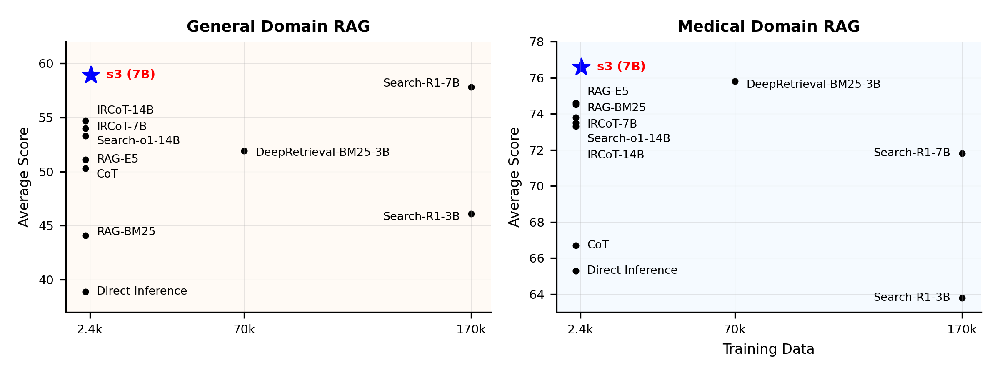
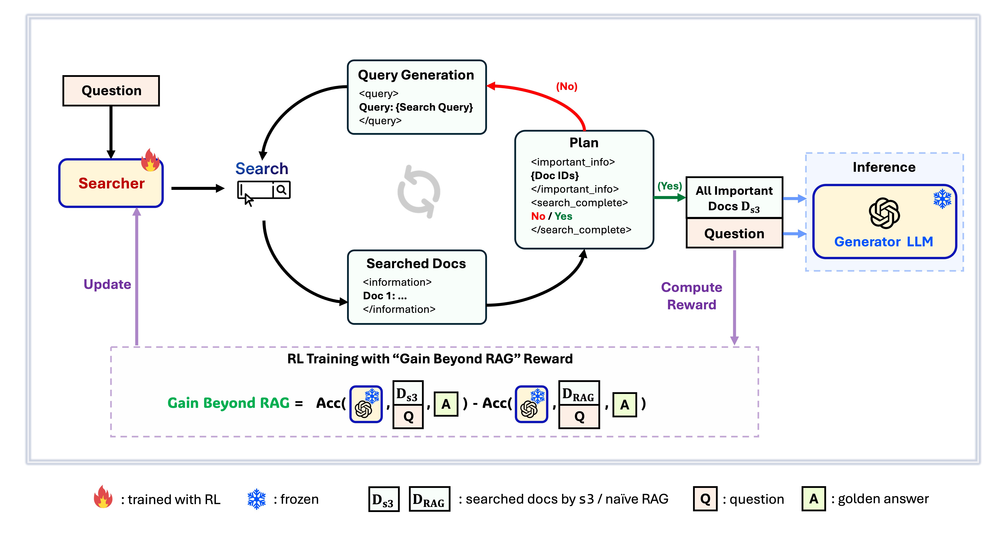

<div align="center">

# s3 - Efficient Yet Effective Search Agent Training via RL
***You Don't Need That Much Data to Train a Search Agent***



**Performance Overview**
</div>


## What is s3?

<div align="center">


**s3 Framework**
</div>

`s3` is a simple yet powerful framework for training search agents in retrieval-augmented generation (RAG). It teaches language models how to search more effectively—without changing the generator itself. By focusing solely on the search component, `s3` achieves strong performance across QA tasks with just a fraction of the data used by prior methods. It's modular, efficient, and designed to work seamlessly with any black-box LLM.


## Table of Contents

- [📦 Installation](#-installation)
- [💡 Preparation](#-preparation)
- [🏋️ Run Training](https://github.com/pat-jj/s3?tab=readme-ov-file#%EF%B8%8F-run-training)
- [🔍 Run Search/Retrieval](https://github.com/pat-jj/s3?tab=readme-ov-file#-run-searchretrieval)
- [📈 Run Evaluation](#-run-evaluation)

## 📦 Installation

**Searcher & Generator Environment**
```bash
conda create -n s3 python=3.9
# install torch [or you can skip this step and let vllm to install the correct version for you]
pip install torch==2.4.0 --index-url https://download.pytorch.org/whl/cu121
# install vllm
pip3 install vllm==0.6.3 # or you can install 0.5.4, 0.4.2 and 0.3.1
pip3 install ray

# verl
cd code
pip install -e .

# flash attention 2
pip3 install flash-attn --no-build-isolation

# we use pyserini for efficient retrieval and evaluation
pip install pyserini    # the version we used is 0.22.1

# quality of life
pip install wandb IPython matplotlib huggingface_hub
```

**Retriever Environment**
```bash
conda create -n ret python=3.10
conda activate ret

conda install pytorch==2.4.0 torchvision==0.19.0 torchaudio==2.4.0 pytorch-cuda=12.1 -c pytorch -c nvidia
pip install transformers datasets pyserini
conda install -c pytorch -c nvidia faiss-gpu=1.8.0
pip install uvicorn fastapi
```


## 💡 Preparation
***Download Index & Corpus***
```bash
python scripts/download.py --save_path $save_path
cat $save_path/part_* > $save_path/e5_Flat.index
gzip -d $save_path/wiki-18.jsonl.gz
```

***Precompute Naïve RAG Initialization***

```bash
# deploy retriever
bash scripts/deploy_retriever/retrieval_launch.sh # or scripts/deploy_retriever/retrieval_launch_mirage.sh for MedCorp corpus.
# deploy generator
bash generator_llms/host.sh # modify tensor-parallel-size to the number of GPUs you use
# run precompute
bash scripts/precompute.sh # this step will take a while, as it will precompute the naïve RAG Cache for training
```


## 🏋️ Run Training
***This step is for the training of S3***

```bash
# deploy retriever
bash scripts/deploy_retriever/retrieval_launch.sh 
# deploy generator
bash generator_llms/host.sh
# run training
bash scripts/train/train_s3.sh
```


## 🔍 Run Search/Retrieval
***This step is for the context gathering of s3 / baselines***

**s3**
```bash
# deploy retriever
bash scripts/deploy_retriever/retrieval_launch.sh 
# run s3 inference
bash scripts/s3_inference/evaluate-8-3-3.sh
```

<details>
<summary>Baselines</summary>

**RAG**
```bash
bash scripts/deploy_retriever/retrieval_launch.sh # or retrieval_launch_bm25.sh # deploy retriever
bash scripts/baselines/rag.sh # run RAG 
```

**DeepRetrieval**
```bash
bash retrieval_launch_bm25.sh # deploy BM25 Model
bash generator_llms/deepretrieval.sh # deploy DeepRetrieval Model
bash scripts/baselines/deepretrieval.sh # run DeepRetrieval Query Rewriting + Retrieval
```

**Search-R1**
```bash
bash retrieval_launch.sh # deploy e5 retriever
bash scripts/baselines/search_r1.sh # run Search-R1
```

**IRCoT**
```bash
bash retrieval_launch.sh # deploy e5 retriever
python scripts/baselines/ircot.py
```

**Search-o1**
```bash
bash retrieval_launch.sh # deploy e5 retriever
bash scripts/baselines/search_o1.sh # run Search-o1
```

</details>


## 📈 Run Evaluation
***This step is for the evaluation of s3 / baselines***


```bash
bash scripts/evaluation/run.sh
```


## Acknowledgement
We would like to thank the following projects:
[verl](https://github.com/volcengine/verl), [RAGEN](https://github.com/RAGEN-AI/RAGEN), [Search-R1](https://github.com/PeterGriffinJin/Search-R1), [DeepRetrieval](https://github.com/pat-jj/DeepRetrieval), [PySerini](https://github.com/castorini/pySerini).
 

## Citation
```bibtex
@article{s3,
  title={s3: You Don't Need That Much Data to Train a Search Agent via RL},
  author={Pengcheng Jiang, Xueqiang Xu, Jiacheng Lin, Jinfeng Xiao, Zifeng Wang, Jimeng Sun, and Jiawei Han},
  howpublished={\url{https://github.com/pat-jj/s3}},
  year={2025}
}
```

Thanks for your interest in our work!


